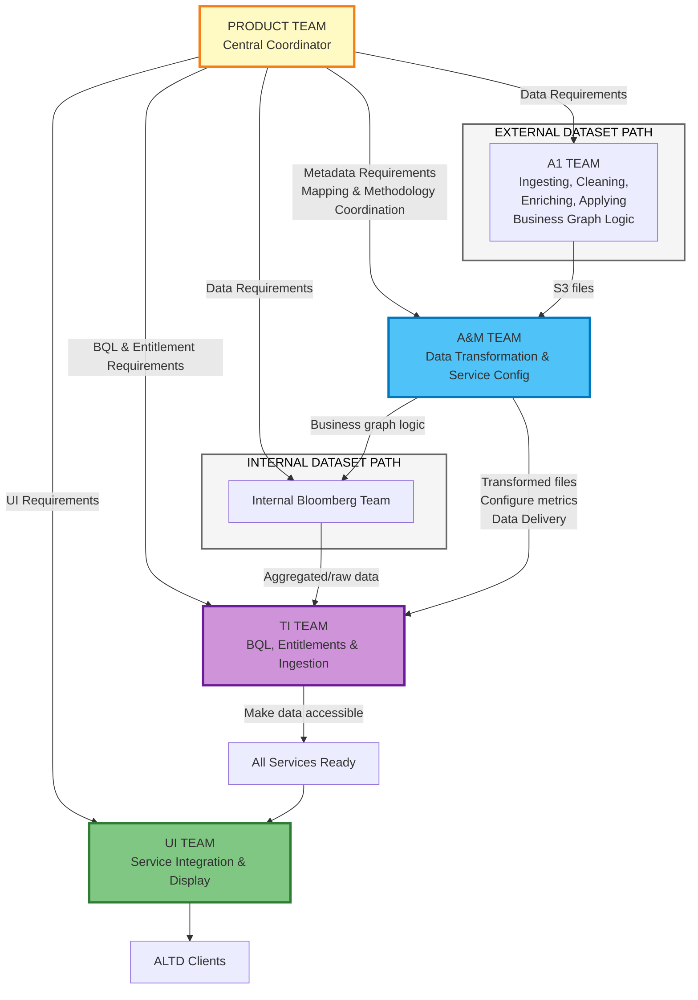
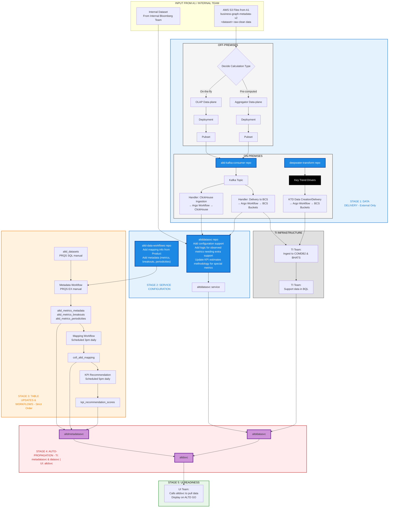

## Team Handoffs Summary

Product coordinates requirements with all teams from the center. Two paths exist: External and Internal datasets.

## A&M Team: Detailed Onboarding Workflow (Stage-Based)

This diagram shows A&M's work organized by stages with repos, services, and tables that get updated.

